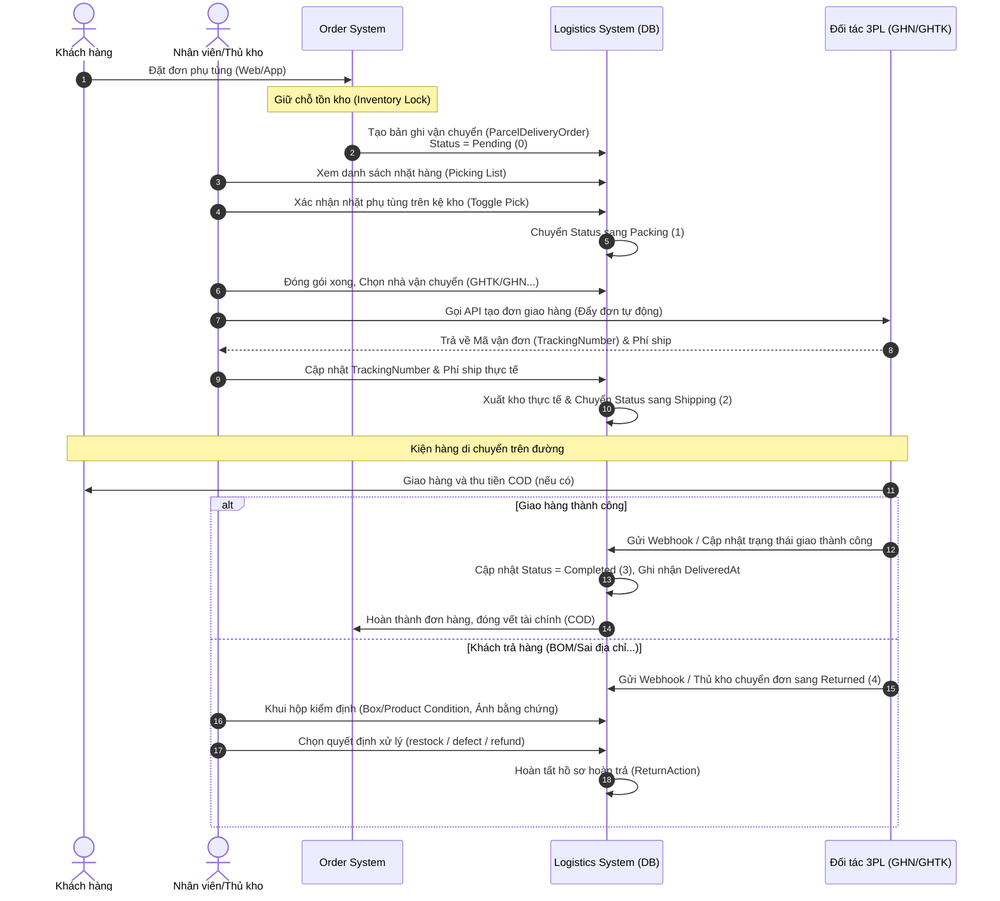

# BÁO CÁO PHÂN TÍCH KIẾN TRÚC CHUYÊN SÂU: MODULE VẬN CHUYỂN

**Dự án:** AnhEmMotor (Management & Backend)  
**Vai trò:** Senior Engineer & Software Architect

---

## 1. Tổng quan cấu trúc thư mục & Danh sách file liên quan

Module Vận chuyển (Logistics) được thiết kế đồng bộ giữa **Frontend (AnhEmMotor-Management)** và **Backend (AnhEmMotor-Backend)**. Dưới đây là danh sách chi tiết các file liên quan:

### A. Frontend (AnhEmMotor-Management)

Hệ thống frontend viết bằng Vue 3 (Setup Script + TypeScript), Element Plus, và TailwindCSS.

- **Menu & Routing:**
  - [src/modules/Order/Menu/index.ts](file:///C:/Users/Admin/Desktop/New/AnhEmMotor-Management/src/modules/Order/Menu/index.ts): Khai báo menu và các sub-routes của Logistics dưới root path `/Order/logistics`.
- **Views (Giao diện 5 trang chính):**
  - **Trang 1: Dashboard:** [src/modules/Order/view/logistics/dashboard/index.vue](file:///C:/Users/Admin/Desktop/New/AnhEmMotor-Management/src/modules/Order/view/logistics/dashboard/index.vue)
  - **Trang 2: Bản đồ Theo dõi:** [src/modules/Order/view/logistics/tracking/index.vue](file:///C:/Users/Admin/Desktop/New/AnhEmMotor-Management/src/modules/Order/view/logistics/tracking/index.vue)
  - **Trang 3: Đơn hàng Hoàn thành (Hiện tại là màn hình đóng gói đơn lẻ):** [src/modules/Order/view/logistics/fulfillment/index.vue](file:///C:/Users/Admin/Desktop/New/AnhEmMotor-Management/src/modules/Order/view/logistics/fulfillment/index.vue)
  - **Trang 4: Đơn hàng Trả lại:** [src/modules/Order/view/logistics/returns/index.vue](file:///C:/Users/Admin/Desktop/New/AnhEmMotor-Management/src/modules/Order/view/logistics/returns/index.vue)
  - **Trang 5: Quản lý Đơn vị Vận chuyển:** [src/modules/Order/view/logistics/carrier-settings/index.vue](file:///C:/Users/Admin/Desktop/New/AnhEmMotor-Management/src/modules/Order/view/logistics/carrier-settings/index.vue)
- **API & Services Layer:**
  - [src/api/logistics/fulfillment.ts](file:///C:/Users/Admin/Desktop/New/AnhEmMotor-Management/src/api/logistics/fulfillment.ts)
  - [src/api/logistics/tracking.ts](file:///C:/Users/Admin/Desktop/New/AnhEmMotor-Management/src/api/logistics/tracking.ts)
  - [src/api/logistics/returns.ts](file:///C:/Users/Admin/Desktop/New/AnhEmMotor-Management/src/api/logistics/returns.ts)
  - [src/api/logistics/index.ts](file:///C:/Users/Admin/Desktop/New/AnhEmMotor-Management/src/api/logistics/index.ts)
  - [src/services/logistics.service.ts](file:///C:/Users/Admin/Desktop/New/AnhEmMotor-Management/src/services/logistics.service.ts)
  - [src/services/logisticsCarrierSettings.service.ts](file:///C:/Users/Admin/Desktop/New/AnhEmMotor-Management/src/services/logisticsCarrierSettings.service.ts)
- **Đa ngôn ngữ (i18n):**
  - [src/i18n/package/vi.ts](file:///C:/Users/Admin/Desktop/New/AnhEmMotor-Management/src/i18n/package/vi.ts) (Đang bị thiếu các key dịch chi tiết cho Logistics)
  - [src/i18n/package/en.ts](file:///C:/Users/Admin/Desktop/New/AnhEmMotor-Management/src/i18n/package/en.ts) (Đầy đủ key dịch tiếng Anh)

### B. Backend (AnhEmMotor-Backend)

Hệ thống backend viết bằng ASP.NET Core theo kiến trúc Clean Architecture, CQRS (MediatR), Repository Pattern và Entity Framework Core.

- **Entities (Domain):**
  - [Domain/Entities/Logistics/ParcelDeliveryOrder.cs](file:///C:/Users/Admin/Desktop/New/AnhEmMotor-Backend/Domain/Entities/Logistics/ParcelDeliveryOrder.cs) (Thực thể trung tâm lưu trữ thông tin vận chuyển và trả hàng)
  - [Domain/Entities/Logistics/ParcelDeliveryOrderItem.cs](file:///C:/Users/Admin/Desktop/New/AnhEmMotor-Backend/Domain/Entities/Logistics/ParcelDeliveryOrderItem.cs) (Chi tiết sản phẩm trong kiện hàng)
  - [Domain/Entities/Logistics/CarrierPartner.cs](file:///C:/Users/Admin/Desktop/New/AnhEmMotor-Backend/Domain/Entities/Logistics/CarrierPartner.cs) (Thực thể lưu cấu hình API 3PL)
  - [Domain/Enums/ParcelDeliveryStatus.cs](file:///C:/Users/Admin/Desktop/New/AnhEmMotor-Backend/Domain/Enums/ParcelDeliveryStatus.cs) (Định nghĩa enum trạng thái giao hàng)
- **WebAPI Layer:**
  - [WebAPI/Controllers/V1/LogisticsController.cs](file:///C:/Users/Admin/Desktop/New/AnhEmMotor-Backend/WebAPI/Controllers/V1/LogisticsController.cs) (Định nghĩa toàn bộ các endpoint gọi từ frontend)
- **Application Layer (Queries & Commands):**
  - **Dashboard:** `GetLogisticsDashboardQuery` & `GetLogisticsDashboardQueryHandler`
  - **Carrier Settings:** `GetCarriersQuery`, `UpdateCarrierPartnerCommand`, `TestCarrierConnectionCommand`
  - **Tracking Map:** `GetActiveShipmentsQuery`, `GetShipmentTrackingQuery`
  - **Fulfillment:** `GetFulfillmentDetailQuery`, `UpdateParcelStatusCommand`, `UpdateTrackingNumberCommand`, `ToggleItemPickCommand`
  - **Returns:** `GetReturnsQuery`, `GetReturnDetailQuery`, `InspectReturnCommand`
- **Infrastructure Layer (Repositories & Seeder):**
  - `IParcelDeliveryOrderReadRepository` & `ParcelDeliveryOrderReadRepository`
  - `IParcelDeliveryOrderUpdateRepository` & `ParcelDeliveryOrderUpdateRepository`
  - `ICarrierPartnerReadRepository` & `CarrierPartnerReadRepository`
  - `ICarrierPartnerUpdateRepository` & `CarrierPartnerUpdateRepository`
  - [Infrastructure/Seeders/CarrierPartnerSeeder.cs](file:///C:/Users/Admin/Desktop/New/AnhEmMotor-Backend/Infrastructure/Seeders/CarrierPartnerSeeder.cs) (Seeder dữ liệu mẫu cho GHTK, GHN, Viettel Post, Shipper Nhà)

---

## 2. API Endpoints, Data Models & Services hiện có

### A. Danh sách các API Endpoints tại Backend

Tất cả các API được triển khai tại route prefix: `/api/v1/logistics`

| STT | HTTP Method | Endpoint                                  | Query/Body Payload                       | Mô tả                                                               |
| :-- | :---------- | :---------------------------------------- | :--------------------------------------- | :------------------------------------------------------------------ |
| 1   | `GET`       | `/dashboard`                              | `?range=today\|month\|year`              | Lấy dữ liệu KPI, biểu đồ và nhật ký bất thường cho Dashboard        |
| 2   | `GET`       | `/carriers`                               | Không                                    | Lấy danh sách các đối tác vận chuyển và trạng thái kết nối          |
| 3   | `PUT`       | `/carriers/{id}`                          | `UpdateCarrierPartnerRequest` (Body)     | Cập nhật cấu hình kết nối API & quy tắc đối tác                     |
| 4   | `POST`      | `/carriers/{id}/test-connection`          | `TestCarrierConnectionRequest` (Body)    | Test thử kết nối API đến máy chủ 3PL                                |
| 5   | `GET`       | `/tracking/{search}`                      | Tham số `search` (Mã vận đơn/SĐT/Mã đơn) | Lấy chi tiết hành trình (Milestones) để vẽ bản đồ                   |
| 6   | `GET`       | `/active-shipments`                       | Không                                    | Lấy danh sách đơn hàng đang vận chuyển (`Status == Shipping`)       |
| 7   | `GET`       | `/fulfillment/{id}`                       | Không                                    | Lấy chi tiết kiện hàng cần đóng gói & giao                          |
| 8   | `PUT`       | `/fulfillment/{id}/status`                | `UpdateParcelStatusCommand` (Body)       | Cập nhật trạng thái đóng gói/vận chuyển của kiện                    |
| 9   | `PUT`       | `/fulfillment/{id}/tracking`              | `UpdateTrackingNumberCommand` (Body)     | Cập nhật mã vận đơn khi đẩy đơn sang 3PL                            |
| 10  | `PUT`       | `/fulfillment/items/{itemId}/toggle-pick` | `ToggleItemPickCommand` (Body)           | Đánh dấu nhặt xong phụ tùng trên kệ kho                             |
| 11  | `GET`       | `/returns`                                | `?status=pending\|inspecting\|completed` | Lấy danh sách đơn hàng bị hoàn trả                                  |
| 12  | `GET`       | `/returns/{id}`                           | Không                                    | Lấy chi tiết đơn hàng hoàn cùng các linh kiện                       |
| 13  | `POST`      | `/returns/{id}/inspect`                   | `InspectReturnCommand` (Body)            | Cập nhật tình trạng khui hộp, đánh giá phụ tùng và quyết định xử lý |

### B. Cấu trúc Data Models chính (Domain Entities)

#### 1. Entity: `ParcelDeliveryOrder`

Đại diện cho một phiếu giao hàng/hoàn trả liên kết với đơn hàng gốc.

- `Id`: ID khóa chính
- `OriginalOrderCode`: Mã đơn đặt hàng gốc (Ví dụ: `ORD-001` từ sale)
- `TrackingNumber`: Mã vận đơn từ bên thứ 3 (GHN, GHTK...)
- `Carrier`: Tên nhà vận chuyển
- `Status`: Trạng thái vận chuyển (`ParcelDeliveryStatus` enum: `0: Pending`, `1: Packing`, `2: Shipping`, `3: Completed`, `4: Returned`)
- `CodAmount`: Số tiền cần thu hộ
- `ShippingCost`: Phí vận chuyển đối tác tính
- `CreatedAt` / `ExpectedAt` / `DeliveredAt`: Các mốc thời gian tạo, dự kiến giao, và thực tế giao thành công
- **Các trường kiểm định hàng hoàn (Returns):**
  - `InspectedAt`: Ngày khui hộp kiểm định
  - `ReturnReason`: Lý do trả hàng (khách từ chối, sai địa chỉ, hư hỏng...)
  - `BoxCondition`: Tình trạng vỏ hộp
  - `ProductCondition`: Tình trạng phụ tùng thực tế
  - `ReturnProofImage`: URL ảnh bằng chứng
  - `ReturnInternalNote`: Ghi chú nội bộ của thủ kho
  - `ReturnAction`: Hướng giải quyết (`restock` - nhập lại kho bán, `defect` - cách ly chờ hủy, `refund` - hoàn tiền)

#### 2. Entity: `CarrierPartner`

Cấu hình API kết nối 3PL và điều kiện lọc đơn.

- `CarrierCode`: Mã code (`ghtk`, `ghn`, `viettel-post`, `shipper-nha`)
- `Name`: Tên hiển thị
- `IsActive`: Trạng thái bật/tắt hoạt động
- `Environment`: Môi trường kết nối (`sandbox` hoặc `production`)
- `ApiBaseUrl` / `ApiToken` / `WebhookSecret` / `WebhookEndpointUrl`: Cấu hình API và webhook
- `AutoSyncPricing`: Bật/Tắt đồng bộ bảng giá
- `MaxParcelWeightKg`: Trọng lượng tối đa cho phép
- `AllowLiquidCargo`: Cho phép vận chuyển chất lỏng (như dầu nhớt, nước làm mát...)
- `AllowOversizeCargo`: Cho phép vận chuyển hàng cồng kềnh (dàn áo xe, lốp xe...)

---

## 3. Luồng dữ liệu (Data Flow) từ Order → Shipping → Customer

Luồng nghiệp vụ xử lý vận chuyển phụ tùng/đồ chơi xe máy diễn ra như sau:

---

## 4. Phân tích hiện trạng chi tiết 5 trang nghiệp vụ

Dưới đây là đánh giá kỹ thuật chuyên sâu về những gì đã có, những gì còn thiếu và các vấn đề cần lưu ý cho từng trang:

### TRANG 1: Dashboard Tổng quan (`/Order/logistics/dashboard`)

- **Đã có:**
  - Template UI cơ bản dùng Element Plus với 4 thẻ KPI: Tổng đơn đang vận chuyển, Tỉ lệ giao thành công (OTIF), Đơn trễ hạn (COD pending), Tỉ lệ trả về.
  - Bảng Carrier scorecard hiển thị hiệu năng theo từng nhà vận chuyển.
  - Bảng Exceptions log liệt kê các đơn ngâm kho quá 24h hoặc giao chậm quá 4 ngày.
  - Backend API `/api/v1/logistics/dashboard` đã được cài đặt hoàn tất với các phép tính SQL thực tế dựa trên bảng `ParcelDeliveryOrders`.
- **Còn thiếu (Critical):**
  - **Kết nối dữ liệu thực:** File `src/services/logistics.service.ts` đang ném lỗi (`throw new Error("Logistics dashboard API not implemented yet")`) khiến dashboard bị crash khi load dữ liệu thực.
  - **Biểu đồ ECharts:** 2 khung biểu đồ (Phễu vận chuyển và Chi phí/Sản lượng giao) hiện tại mới chỉ là chuỗi text placeholder đơn giản. Chưa import và cấu hình ECharts để vẽ biểu đồ dựa trên dữ liệu trả về từ API (`fulfillmentFunnel` và `trends`).
  - **Bản dịch Tiếng Việt (i18n):** File `vi.ts` thiếu toàn bộ các key dịch của `logistics.dashboard.*`, làm giao diện bị hiển thị thô dạng text key.

### TRANG 2: Bản đồ Theo dõi Vận chuyển (`/Order/logistics/tracking`)

- **Đã có:**
  - Tích hợp Leaflet Map hiển thị bản đồ trực quan.
  - Bố cục split-screen: Bên trái là danh sách các đơn hàng đang giao (`Status == Shipping`) lấy từ API `getActiveShipments` có bộ lọc tìm kiếm; Bên phải là bản đồ hành trình.
  - Xem chi tiết một đơn hàng: Hiển thị thông tin khách hàng, sản phẩm, và trục thời gian hành trình (Milestones).
  - Tính năng vẽ lộ trình: Vẽ đường thẳng nối liền từ Showroom -> Bưu cục hiện tại (Nét liền màu xanh) -> Địa chỉ khách hàng (Nét đứt màu xám). Có hiệu ứng radar pulse cảnh báo nguy cơ trễ hẹn.
- **Còn thiếu / Cần tối ưu:**
  - Leaflet trên môi trường Windows/Vite đôi khi bị lỗi mất marker icon mặc định (Mặc dù code đã có đoạn fix override, nhưng cần kiểm tra tính ổn định).
  - Dữ liệu Milestones hiện đang được giả lập ở database. Cần đề xuất luồng kết nối API thực tế từ nhà vận chuyển (hoặc webhook nhận hành trình từ 3PL) để cập nhật tọa độ bưu cục thực.

### TRANG 3: Đơn hàng Hoàn thành (`/Order/logistics/fulfillment`)

- **Đã có:**
  - UI chi tiết đóng gói: Bảng picking checklist (checklist từng phụ tùng trên kệ kho), nút bấm cập nhật trạng thái (Bắt đầu đóng gói -> Xuất kho -> Hoàn thành), nút nhập tay mã vận đơn của nhà vận chuyển.
- **Còn thiếu (Nghiêm trọng - Sai lệch yêu cầu):**
  - **Chưa đúng thiết kế trang:** Trang này hiện tại đang là giao diện xử lý đóng gói chi tiết của một đơn hàng cụ thể (đang hardcode ID đơn = 1).
  - **Yêu cầu thực tế:** Trang 3 phải là **"Danh sách Đơn hàng Hoàn thành"** có đầy đủ bộ lọc thời gian, đơn vị vận chuyển, khu vực (địa lý) và hiển thị các thông tin: Mã đơn, Giá trị, Khách nhận hàng lúc nào, Thời gian giao dự kiến vs thực tế, Đơn vị vận chuyển + Mã vận đơn.
  - **Giải pháp đề xuất:** Viết lại trang `fulfillment/index.vue` thành dạng bảng danh sách (Datatable) hiển thị các đơn hàng vận chuyển đã giao thành công (`status == Completed`). Khi click vào một dòng đơn hàng, sẽ mở Panel trượt (Sliding Drawer) từ cạnh phải hiển thị chính giao diện Picking checklist & timeline chi tiết (tái sử dụng UI hiện tại).

### TRANG 4: Đơn hàng Trả lại (`/Order/logistics/returns`)

- **Đã có:**
  - Giao diện split-screen hoàn chỉnh: Bên trái là danh sách đơn chờ hoàn với bộ lọc trạng thái (Chờ xử lý, Đang kiểm tra, Đã xong); Bên phải là chi tiết khui hộp.
  - Khối kiểm định thực tế: Chọn tình trạng vỏ hộp, tình trạng phụ tùng, nút tải ảnh bằng chứng và nhập ghi chú.
  - Bộ ba nút quyết định: Nhập kho bán lẻ (`restock`), Cách ly chờ hủy (`defect`), Hoàn tiền cho khách (`refund`).
  - Kết nối API backend hoàn chỉnh (`getReturns`, `getReturnDetail`, `inspectReturn`).
- **Còn thiếu / Cần tối ưu:**
  - Thiếu trường thông tin: Giá trị hoàn lại và chi phí vận chuyển phát sinh (hiện tại entity `ParcelDeliveryOrder` có `CodAmount` và `ShippingCost` nhưng chưa tách biệt trường "Chi phí phát sinh do hoàn hàng" - ví dụ phí chuyển hoàn thường bằng 50% phí ship gốc).
  - Phần upload ảnh bằng chứng hiện tại đang mock timeout. Cần tích hợp với API upload file thực tế của hệ thống.

### TRANG 5: Quản lý Đơn vị Vận chuyển (`/Order/logistics/carrier-settings`)

- **Đã có:**
  - Bảng hiển thị lưới 4 đối tác vận chuyển chính (GHTK, GHN, Viettel Post, Shipper Nhà).
  - Bật/tắt nhanh trạng thái hoạt động của đối tác.
  - Drawer chi tiết cấu hình API: Sandbox vs Production, API Base URL, API Token, Webhook Secret, Webhook URL.
  - Tab "Quy tắc vận chuyển": Cấu hình Max weight, cho phép hàng chất lỏng/dầu nhớt, hàng cồng kềnh.
  - Nút bấm "Kiểm tra kết nối" (Test Connection) gọi đến API backend.
- **Còn thiếu:**
  - **Bảng giá cước và SLA cam kết:** Yêu cầu hiển thị bảng giá cước (theo khu vực, trọng lượng) và SLA cam kết (thời gian giao hàng theo vùng) ngay trên giao diện cấu hình của từng nhà vận chuyển. Hiện tại entity `CarrierPartner` mới chỉ lưu cấu hình kết nối API chung chứ chưa có bảng định nghĩa giá cước hoặc SLA chi tiết.

---

## 5. Đề xuất kiến trúc & Kế hoạch triển khai hành động

### Đề xuất Kiến trúc API 3PL thực tế (GHN, GHTK)

Để không phá vỡ kiến trúc CQRS hiện tại của dự án:

1. **API Client:** Tạo một Service trung gian `ThirdPartyLogisticsService` ở Backend (Infrastructure) chịu trách nhiệm call API thực tế đến GHN/GHTK khi trạng thái chuyển sang "Xuất kho".
2. **Webhook Endpoint:** Cấu hình Webhook Controller để tiếp nhận cập nhật hành trình tự động từ GHN/GHTK, sau đó phát Event cập nhật tọa độ cho trang Bản đồ Theo dõi (`OrderLogistics`).

### Kế hoạch hành động chi tiết (Sắp xếp theo thứ tự ưu tiên)

#### Bước 1: Khắc phục Dashboard & Vẽ biểu đồ thực tế (Trang 1)

- **Frontend:**
  - Thay đổi `LogisticsService.getDashboard` để gọi API thực tế `/api/v1/logistics/dashboard`.
  - Đồng bộ file `vi.ts` dịch tiếng Việt cho các key dashboard từ `en.ts`.
  - Tích hợp thư viện `echarts` vào `dashboard/index.vue` để vẽ biểu đồ tròn (Doughnut Chart) cho `fulfillmentFunnel` và biểu đồ cột kết hợp đường (Combo Bar + Line Chart) cho xu hướng sản lượng & chi phí ship (`trends`).

#### Bước 2: Thiết kế lại trang Đơn hàng Hoàn thành (Trang 3)

- **Frontend:**
  - Thiết kế lại `fulfillment/index.vue` thành danh sách đơn hàng đã hoàn thành (`status == Completed` hay status = 3) sử dụng component `<ArtTable>` sẵn có của dự án.
  - Thêm bộ lọc: Thời gian (Từ ngày - Đến ngày), Đơn vị vận chuyển (Dropdown), Khu vực (Tỉnh/Thành phố).
  - Khi click vào mã đơn hàng, mở Drawer hiển thị thông tin đóng gói, check-list sản phẩm và timeline hành trình (tận dụng UI cũ).

#### Bước 3: Cải tiến trang Đơn hàng Trả lại (Trang 4)

- **Backend & Frontend:**
  - Bổ sung hiển thị thông tin giá trị hoàn lại và chi phí vận chuyển phát sinh trên giao diện kiểm định.
  - Kết nối nút "Tải ảnh lên" với API upload file thực tế của hệ thống backend thay vì giả lập timeout.

#### Bước 4: Hoàn thiện Quản lý Đối tác & SLA (Trang 5)

- **Frontend & Backend:**
  - Bổ sung Tab "Bảng giá & SLA" trong Drawer cấu hình của đối tác vận chuyển.
  - Hiển thị thông tin bảng giá theo trọng lượng/vùng miền (có thể lấy động từ API của GHN/GHTK nếu đối tác bật "AutoSyncPricing" hoặc cho phép cấu hình thủ công).
